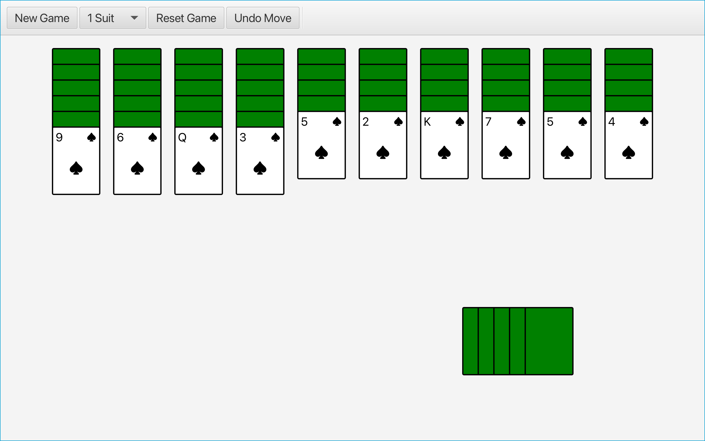
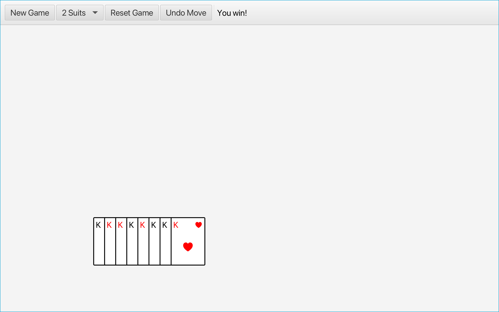
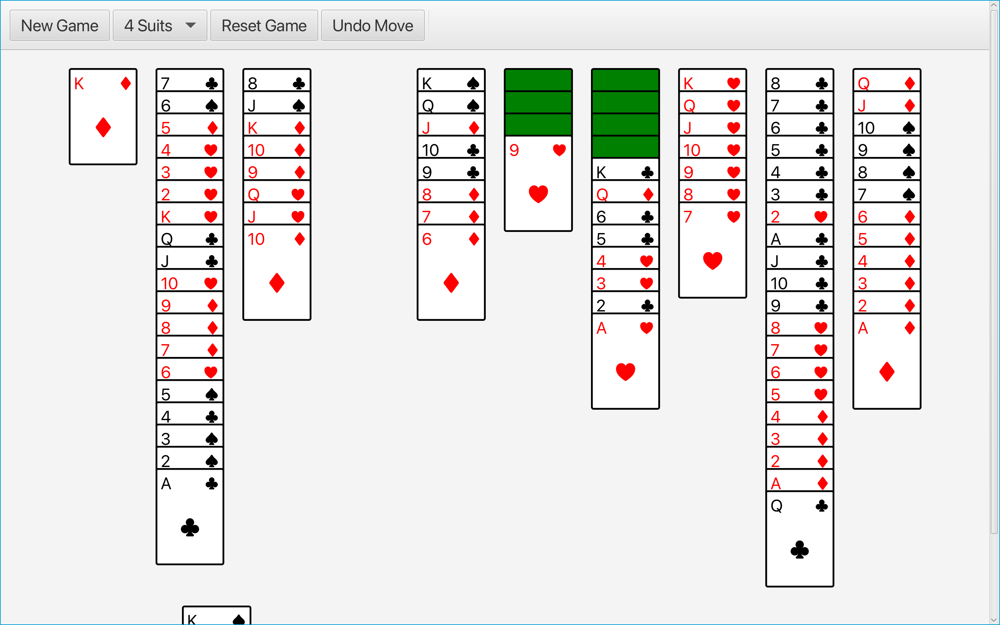
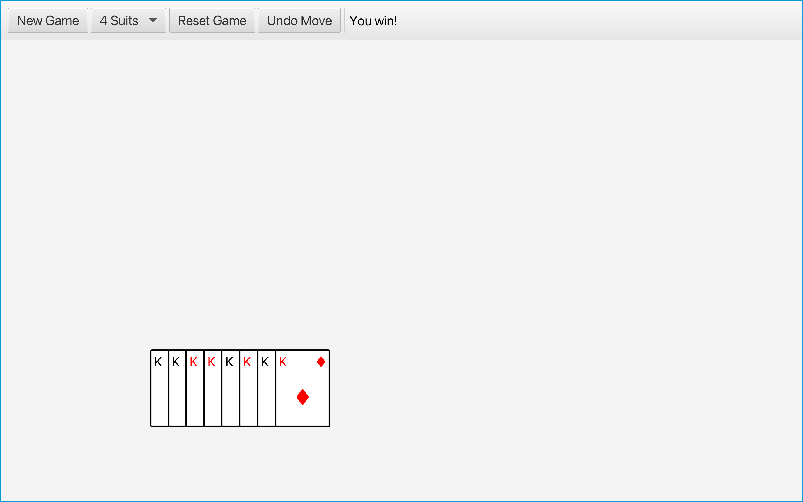

# Spider Solitaire

Spider Solitaire is a version of solitaire played with two 52-card decks where the objective is to remove all of the
cards from the board.

## Download

Spider Solitaire is available for download. Go to the
[releases](https://github.com/RobinEatingWorm/spider-solitaire/releases) for more information.

## Rules

### Columns

Cards are dealt in 10 columns and can be moved between them. In Spider Solitaire, aces are the lowest rank and kings are
the highest. A single card can be moved to another column if its rank is one lower than the rank of the card it is being
moved onto (regardless of their suits). A stack of cards can only be moved if all cards in the stack have the same suit
and ranks that are in order (i.e., the rank of a card in the stack must be one lower than the rank of the previous card
in the stack).

If all of the cards in a column would be face down, the last card in the column is turned face up automatically. Any
card or ordered stack of cards can be moved to an empty column.

### Runs

A run is a stack of cards sharing the same suit and ordered by rank (starting from king and ending at ace). Runs are
automatically removed from the board when they are created. Completing all runs wins the game.

### Stocks

Stock piles are located on the bottom-right. Click on a stock to add a new card to the end of each column on the board.
A stock can only be used if no columns are empty.

## Gameplay

- Click on cards in columns to select them. Click on a valid column when cards are selected to move them.
- You can also drag cards across columns.
- Click on the stock piles to use one if possible.
- Access game controls using the toolbar at the top. Available controls include starting a new game with the specified
  number of suits (1, 2, or 4), resetting the current game, and undoing the last move.

## Known Issues

- When switching between a windowed and fullscreen view, elements may not resize correctly at first. Make any move,
  click on any of the buttons in the toolbar, or resize the window (if not in fullscreen) to fix this issue.

## Technical Details

Spider Solitaire was built using JDK 21 and JavaFX version 23. Compressed archives for JDK 21 or newer are available on [Oracle](https://www.oracle.com/java/technologies/downloads/) or [jdk.java.net](https://jdk.java.net/archive/). The SDK and jmods for JavaFX version 23 or newer are available from [Gluon](https://gluonhq.com/products/javafx/).

## Gallery

